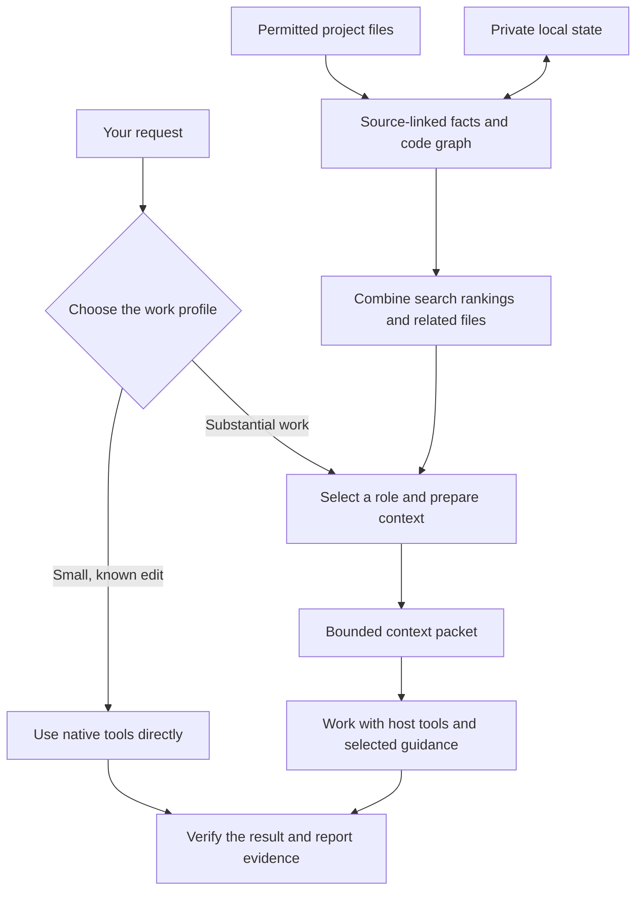

# agent-dispatcher

[](https://github.com/nahid-sparktales/agent-dispatcher/actions/workflows/ci.yml)
[](https://github.com/nahid-sparktales/agent-dispatcher/actions/workflows/security.yml)

**Give each Claude Code or Codex task the specialist, context, and skills it needs.**

Agent Dispatcher routes your request to a focused role, loads relevant guidance, and defines
what evidence will count as done. Ask it to debug a failure, design an interface, review a
change, or research a decision. For substantial code tasks, it combines paths, symbols, source
content, code relationships, and Git history to find relevant files and assemble a bounded
context packet. Project indexes stay in private local storage and reuse unchanged evidence.
Small, known edits can take the direct path. Optional model assistance adds file summaries and
candidate reranking when you enable it.

<!-- counts:start -->**27 roles · 79 local skills · 31 external skills · 8 recipes · 19 MCP servers · 50 detection signals**<!-- counts:end -->

[How it works](#how-it-works) · [Quick start](#quick-start) · [Usage](#usage) ·
[Local context](#build-local-context) · [Project mapping](#keep-a-project-map-current) ·
[Optional model assistance](#optional-model-assisted-retrieval) · [Catalog](#catalog) ·
[Documentation](#documentation) · [Contributing](#contributing)

## Why use it?

- **Match the method to the task.** A debugger reproduces the failure; a reviewer evaluates the
  change; a designer works through the interface and interaction.
- **Load context as needed.** Roles select a small set of skills, project files, and available
  tools. Full skill instructions are read only when selected.
- **Reuse project knowledge.** Source-linked facts and a structural graph help locate relevant
  code. Private caches let later preparation reuse unchanged sources, index records, and the
  resolved graph without adding files to the working tree.
- **Explain file selection.** Several search methods contribute ranked candidates. Each selected
  file carries its reasons, matched symbols, relationships, and relevant source excerpts.
- **Make verification explicit.** The role defines the evidence needed and reports which checks
  actually ran, what passed, and what remains unverified.
- **Respect the task's edit scope.** Cache maintenance checks its write boundary. Read-only
  previews and optional change audits support work that must preserve other files.
- **Keep control of routing.** Let the dispatcher choose, force a role yourself, or opt into
  automatic activation for future sessions.

Roles are working instructions the coding agent adopts within a session. It can chain roles or
assign roles to subagents when authorized and useful. Installing the pack does not start a team of
agents or connect external services.

## How it works



Preparation analyzes the request, searches permitted files, and combines evidence from paths,
rare terms, source text, symbol definitions, symbol references, and quoted literals. Strong
matches can bring in related imports, callers, tests, and files that frequently change together.
A final budget selects source excerpts and preserves the reason each file was included. See
[repository intelligence](docs/repository-intelligence.md) for the selection rules.

Default retrieval is deterministic and local: its helpers make no model or network calls and
need no background service. The [optional model layer](#optional-model-assisted-retrieval) can
search stored file summaries and rerank a bounded candidate set. Those summaries help find
files; the coding agent still receives actual source excerpts. The full index stays local.

Claude Code or Codex provides the model, tools, permissions, and execution environment.
Dispatcher does not switch the host's model or effort. When useful independent subtasks exist
and delegation is authorized, the host's subagent tools can handle them with separate scopes.

## Quick start

You need an installed, authenticated [Claude Code](https://code.claude.com/docs/en/overview)
or [Codex](https://developers.openai.com/codex/), and Git. The installers, validation suites, and
optional decision engine use Python 3.10+ with no third-party Python packages. The Claude session
hook also uses Bash and standard Unix utilities. CI covers Python 3.10–3.14 on Linux and Python
3.14 on macOS. Native Windows
installation is not covered; use a Unix environment such as WSL.

### Codex

Run in your terminal:

```bash
git clone https://github.com/nahid-sparktales/agent-dispatcher.git
cd agent-dispatcher
python3 install_codex.py
```

Start a new Codex task, select **Agent Dispatcher** from the skill picker or invoke it with `$`:

```text
$agent-dispatcher Find why the tests are failing, fix the cause, and verify the fix.
$agent-dispatcher reviewer Review this change for correctness and missing tests.
$agent-dispatcher context explain
$agent-dispatcher doctor
$agent-dispatcher status
```

This installs one skill in `~/.agents/skills/agent-dispatcher/`. It includes all 27 roles and
79 supporting guides from the same sources as Claude. Guides load only when selected.
Automatic session activation is off by default; enabling it requires Codex's hook trust review.
See [Codex setup, controls, and uninstall](adapters/codex/README.md).

### Claude Code plugin

Run in your terminal:

```bash
claude plugin marketplace add nahid-sparktales/agent-dispatcher
claude plugin install agent-dispatcher@agent-dispatcher
```

Start a new Claude Code session in your project, then try:

```text
/agent-dispatcher:agent-dispatcher Find why the tests are failing, fix the cause, and verify the fix.
```

The dispatcher reads the selected role and guides, then announces the role, loaded skills,
and selected tools before starting the task. To inspect the installation and activation state:

```text
/agent-dispatcher:agent-dispatcher status
```

Plugin commands use the `agent-dispatcher:` prefix, following
[Claude Code's plugin namespacing](https://code.claude.com/docs/en/plugins).
For example, the reviewer command is `/agent-dispatcher:agent-reviewer`.

<details>
<summary>Alternative: manual installation</summary>

Run in your terminal:

```bash
git clone https://github.com/nahid-sparktales/agent-dispatcher.git
cd agent-dispatcher
./install.sh
```

The installer builds and validates the pack, copies its skills into
`~/.claude/skills/agent-dispatcher/`, adds role commands under `~/.claude/commands/`, and
registers a `SessionStart` hook. It backs up an existing `settings.json` before adding the hook
and skips command files it does not own. `CLAUDE_CONFIG_DIR` overrides the default config directory.

Updates are staged before live files are replaced. If a replacement fails, the installer
restores the previous pack, commands, hook, settings, and manifest. A failed staging check
leaves the installed version untouched. See [manual installer recovery](adapters/claude-code/README.md#installing)
for the recovery limits.

Start a new Claude Code session and use the shorter command names:

```text
/agent-dispatcher Find why the tests are failing, fix the cause, and verify the fix.
/agent-dispatcher status
```

Use one installation method per host at a time to avoid duplicate commands and hooks.

</details>

No additional API key is needed for normal dispatcher use. Your coding agent's access and usage
requirements still apply. External skills and MCP servers are catalog references; the pack does
not install them.

## Usage

The examples and catalogs below use **Claude Code manual-install command names**. For a Claude plugin install,
add `agent-dispatcher:` after the slash: `/agent-context` becomes
`/agent-dispatcher:agent-context`.

In Codex, use `$agent-dispatcher <request>`. Choose a role with `$agent-dispatcher reviewer`,
inspect context with `$agent-dispatcher context`, and use `$agent-dispatcher decision` for
decision settings. The catalog's `/agent-uidesigner` maps to `$agent-dispatcher uidesigner`,
and the other role aliases work the same way. Activation arguments such as `on here` and
`off everywhere` are shared between hosts; their settings are stored separately.

### Let the dispatcher choose

```text
/agent-dispatcher Redesign the settings page, implement it, and check it on mobile.
/agent-dispatcher Review this change for correctness and missing tests.
/agent-dispatcher Compare the approaches already used in this repository and recommend one.
```

Routing follows the requested deliverable, using three execution profiles without an extra
router or model call:

- **Direct:** trivial work or one safe, obvious edit in a known file. Skip role/guide loading,
  context preparation, preference lookups and reporting references; use known preferences or
  defaults and check the result with native tools. Required checks still apply.
- **Guided:** work needing specialist judgment or investigation. Select a role, prepare context
  before substantial investigation, and load only the guidance the task needs.
- **Coordinated:** guided work with useful independent subtasks. Give workers separate scopes
  and combine their evidence using the host's subagent tools.

Security-sensitive work, configuration or behavior ambiguity, and multi-file tasks stay guided.
If a direct task reveals wider scope or uncertainty, prepare before investigating further.
Explicitly selected roles, invoked workflows, user instructions and host permissions always
win. Profiles do not switch the host's model, effort or permissions.

### Prepare less repeated context

Substantial work uses a compact context packet containing source excerpts, the selected role's
instructions, and resource locations. Supplied guidance is consumed directly instead of read
again from its file. Repeatable `--guide ID` supplies eligible guide bodies. Compact packets keep
up to three other guide candidates, prioritizing verification, and omit duplicate role metadata.
Explicit guides resolve against the full eligible catalog even when absent from the shortlist.

`--packet-tokens N` bounds the estimated size of the whole compact packet, including guidance,
metadata, diagnostics, map facts, graph views and excerpts. This is not a measurement of the host's full
context window or model usage. Normal preparation uses `--compact`; omit it with `--json` for
full inspection. Missing required evidence still needs investigation; a small packet is not
proof of completeness.

During substantial source work, `--map-maintain` uses the same scan to maintain the source-linked
project map and structural graph when safe writes are permitted. Excluded or incomplete scans defer persistence;
unsafe destinations leave a read-only result with diagnostics. Both writers veto recognized task
restrictions and roles whose tool posture is read-only. Use `--map-preview` for edit limits the
helper may miss, such as unusual wording or plan mode; preview always wins. Repeat `--writable-path` to enforce literal permitted files or
subtrees (trailing `/`), independently of source-reading exclusions. Deferred maintenance still
returns fresh evidence and explains its write decision. Map facts never authorize execution.

Repeated preparation may opt into `--reuse-state ABS --reuse-scope ID`, using an authorized
absolute state path outside the project. Reuse references only within the same context that
still retains the earlier content. Changed evidence is supplied again. A fresh chat, new worker
or lost/compacted evidence needs a fresh scope or full output. This does not enable automatic
cross-chat memory, an observer or background processing. See the
[context procedure](skills/agent-dispatcher/CONTEXT.md) for limits and inspection controls.
The [project-intelligence design](docs/project-intelligence.md) explains how mapping, caching,
retrieval, and the final packet fit together. Packet limits cover the helper's output, not the
host's entire conversation or model usage.

### Choose a role or inspect a decision

| Command | Purpose |
| --- | --- |
| `/agent-uidesigner` | Work as the UI/UX Designer. |
| `/agent-debugger` | Work as the Debugger. |
| `/agent-reviewer` | Work as the Reviewer. |
| `/agent-inventory` | List skills, tools, and MCPs with usability and setup status. |
| `/agent-doctor` | Check installation health, list every capability, and recommend relevant setup. |
| `/agent-context` | Show the current context plan. |
| `/agent-context build <request>` | Retrieve relevant workspace passages with locations, reasons, and a size budget. |
| `/agent-map [show\|build\|refresh]` | Record project facts with source links and detect when those sources change. |
| `/agent-context explain` | Explain the role, skills, and tools selected. |
| `/agent-context verbose` | Include candidates, dropped files, and the context budget. |
| `/agent-decision` | Show optional decision-engine configuration and status. |
| `/agent-verify run\|show\|note` | Record actual checks, inspect freshness, or disclose a check that wasn't run. |
| `/agent-preferences show\|set` | Inspect or save output style and requested effort. |

A directly selected role stays active until you choose another or stop the dispatcher.

### See what the dispatcher loads

Compact output is the default. It combines the role and resources into one progress line:

```text
→ reviewer · Skills loaded: secure-code-review · Tools selected: files, terminal · MCPs: none selected
```

For more detail, switch to verbose output. In Codex:

```text
$agent-dispatcher output verbose
$agent-dispatcher output compact
$agent-dispatcher output
```

In Claude Code, use `/agent-dispatcher output verbose` or `output compact` (with the
`agent-dispatcher:` prefix for plugin installations). `output` reports the current style.
You can also say "use verbose output" or "show what you load".

Verbose output explains the selections and names context read, recipes loaded, unavailable
resources and fallbacks, and planned verification. For example:

```text
Role: reviewer — evaluate the change for correctness and regressions
Skills loaded: secure-code-review — inspect the changed security boundary
Tools selected: files, terminal — available; inspect the diff and run checks
MCPs: none selected
Recipe loaded: review-pull-request — structure the review
Verification planned: focused regression checks; not run yet
```

These are examples, not a fixed loadout. Only skills actually read are labeled loaded;
selected MCP servers are marked used only after a call. Later additions get a short update,
and the final report names tools used and checks performed. Trivial tasks skip the summary.

The setting lasts for the conversation; new conversations default to compact. It changes
activity reporting, not routing, permissions, or the length of the requested deliverable.
`context verbose` remains a one-time inspection of the context plan.

### Short answers backed by checks

Final replies default to **ELI5 succinct**: plain language, answer first, usually under 150
words. They say what changed, what actually passed and what remains unchecked. This style is
adapted from [isas1/skills](https://github.com/isas1/skills/tree/main/skills/eli5-succinct)
under MIT; see [NOTICE](NOTICE). Detailed evidence stays available separately.

Save preferences in Codex:

```text
$agent-dispatcher preferences set --output eli5-succinct --effort low
$agent-dispatcher preferences show
```

Claude uses `/agent-preferences` with the same arguments. Add `--project PROJECT` when setting
a project override. Settings live outside the project in Dispatcher-owned configuration.
Low effort is a **saved request**, not proof the host changed its active setting; the helper
never edits Claude or Codex model configuration. Default effort is `host` until changed.
Activity `output compact|verbose` remains separate.

The verification helper wraps authorized commands and fingerprints workspace files. Default
receipts are temporary: evidence is returned and owned files are removed with a cleanup result.
Explicit retained receipts can be inspected after edits and removed with `show --cleanup`.
Failed checks, zero tests, unknown counts and checks not run remain distinct. Optional preparation
with `--audit` captures a task baseline before helper writes; start it before any task edits.
Finishing the audit reports actual file changes, including untracked/ignored caches, then cleans
its state. Partial scans cannot prove preservation. No observer, behavioral-coverage claim or
permission bypass is enabled. See the
[verification guide](skills/agent-dispatcher/VERIFICATION.md) for commands and coverage limits.

### List what is usable and what needs setup

In Codex:

```text
$agent-dispatcher inventory
$agent-dispatcher inventory skills
$agent-dispatcher inventory tools
$agent-dispatcher inventory mcps
$agent-dispatcher inventory setup
$agent-dispatcher inventory setup verbose
```

In Claude Code, use `/agent-inventory` with the same filters, or
`/agent-dispatcher:agent-inventory` for a plugin install. `/agent-dispatcher inventory` also works.

The report covers bundled guides, referenced external skills, other host-exposed skills,
visible tools, and catalog or host-exposed MCP servers. Each entry has a status and a next step:

| Status | Meaning |
| --- | --- |
| Usable | Guidance is readable or the tool is exposed, with no known blocker. Tool connectivity may still be untested. |
| Needs setup | A missing installation, dependency, connection, or authentication step is confirmed. |
| Blocked | A user preference or host permission prevents use. |
| Unknown | Available evidence is insufficient; the report names what to check. |
| Not recommended | The registry records an unmaintained or retired integration and its fallback. |

`setup` filters to entries needing attention. `verbose` adds evidence, prerequisites, source
links, and fallbacks; compact still lists every entry in the requested scope. The command
inspects availability without loading every skill, probing accounts, or installing anything.
It reports discovery limits rather than treating an unseen integration as missing. Usability
is separate from permission to perform a particular action.

### Build local context

The dispatcher uses a local selector after choosing a role for substantial or unfamiliar
workspace tasks. It skips trivial edits and configuration controls. To inspect context directly:

```text
$agent-dispatcher context build Investigate why validate_login rejects valid sessions
/agent-context build Investigate why validate_login rejects valid sessions
```

The first form is for Codex, the second for Claude Code. Inspection returns relevant passages,
file locations, line numbers, selection reasons, exclusions and an estimated size budget; it does
not perform the requested change. Existing `context`, `context explain`, and `context verbose`
commands still inspect the context plan.

The selector uses repository intelligence by default (`--retrieval auto`). It recognizes paths,
dotted modules, code identifiers, and quoted errors; combines independent search rankings using
reciprocal rank fusion; then expands the strongest matches through bounded code relationships
and Git co-change history. Explicitly named files stay first. `--retrieval legacy` selects the
older flat scorer, which is also the fallback if the new engine cannot load.

Ignore rules, task exclusions, and credential checks run before retrieval. Excluded sources
cannot reappear through symbols, history, explorer requests, or explain output. Files above
the 256 KiB source-read limit can still be ranked by path and relationships, but their contents
are not read or excerpted. Scan limits and unavailable evidence are reported. A limited packet
is a starting point; the agent can read additional evidence when needed.

Default retrieval needs no model call. If you have enabled model assistance, preparation can
also use current stored summaries and the configured reranker. Querying never generates missing
summaries. Optional bounded exploration (`--retrieval full+explorer` or `retrieval.py expand`)
can request symbols, paths, callers, references, and neighbors from the existing index;
it is off by default.

The dispatcher entrypoint and concise context guide are each capped at 6 KiB per host. Role
catalogs, configuration controls, delegation and advanced examples live in references read only
when needed. These are limits on dispatcher instructions and retrieved passages, not the host's
whole context window or a claim of improved model performance.

From the source checkout, pass the request as one quoted argument. This also avoids heredoc
handling differences between hosts:

```bash
python3 -B context.py --project /path/to/project --role debugger \
  --task='Investigate why validate_login rejects valid sessions. Do not change any files.' \
  --compact --map-preview --json
```

`--map-preview` prevents map and parser-cache writes; it does not disable a user-enabled
reranker. To inspect deterministic retrieval without model assistance:

```bash
python3 -B retrieval.py explain-query 'Investigate why validate_login rejects valid sessions'
python3 -B retrieval.py explain 'Investigate why validate_login rejects valid sessions' \
  --project /path/to/project --verbose --no-llm
```

`explain-query` shows which words became paths, symbols, concepts, or ignored terms. `explain`
shows each search method's contribution, relationships, and budgeting decisions. Omit
`--no-llm` to include your enabled model layer; `context.py --explain` embeds the trace in a packet.

Use `--size small|standard|complex` for retrieval scope, `--max-files N` and `--max-bytes N`
to tighten file and excerpt limits, `--max-tokens N` for excerpt tokens, or `--packet-tokens N`
for the whole compact packet. Each file gets an initial excerpt before second excerpts are
added; duplicate content and tests are constrained to leave room for distinct source files.
See [context selection](docs/context-engine.md) for controls and limits.

### Keep a project map current

Dispatcher maintains two project indexes and a separate private cache. Optional model-written
representations have their own store. These serve different purposes; none stores a conversation
or replaces the host's instructions.

| Stored data | Location | Purpose |
| --- | --- | --- |
| Fact map | `~/.cache/agent-dispatcher/state-v1/<project id>/project-map.json` | Feature locations, declared dependencies, test commands, and documented architecture decisions, with source locations and fingerprints. |
| Structural graph | `~/.cache/agent-dispatcher/state-v1/<project id>/project-graph.json` | Files, Python symbols, imports, supported direct calls, and candidate test relationships, with evidence and confidence labels. |
| Incremental parser cache | `~/.cache/agent-dispatcher/parser-v1/` | Authenticated records of redacted source text, extracted facts, per-file retrieval records, filtered Git history, and resolved graphs. |
| Optional file summaries | `~/.cache/agent-dispatcher/llm-retrieval-v1/` | Model-written retrieval aids keyed by source content, model, provider, and prompt/schema versions. |
| Optional deep index | `~/.cache/agent-dispatcher/state-v1/<project id>/repository-index.sqlite` | Complete admitted inventory, per-file records, symbols, relationships, corpus statistics, bounded history and Explorer inferences; built only by `repository_intelligence.py build`. |
| Optional task experience | `~/.cache/agent-dispatcher/state-v1/<project id>/experience.sqlite` | Explicitly recorded task events with outcomes, corrections and forgetting; used only when enabled. |

The map, graph, and parser cache honor an absolute `XDG_CACHE_HOME`. Their locations must be
outside the inspected project. Older `.agent-dispatcher/project-map.json` and
`project-graph.json` files are validated and read when no private copy exists; maintenance
does not rewrite or delete them. Current index maintenance creates no `.agent-dispatcher/`
directory or working-tree changes. The optional summary store uses the separate path above.

During substantial guided work, `context.py --compact --map-maintain` requests automatic
maintenance. A complete, unrestricted scan can create or refresh both project indexes and
populate the private cache. No discovered test command or project module is executed to build
them. Maintenance happens during context preparation; there is no background watcher.

On later preparations:

1. **Check the current inventory.** Apply ignore rules, task exclusions, and file safety checks
   before using a source. New, deleted, renamed, and newly ignored paths affect the current view.
2. **Reuse unchanged evidence.** Valid cached entries can avoid repeated source reads, parsing,
   and fact extraction. Changed sources are read again; missing or invalid entries fall back
   to fresh extraction. File identity, timestamps, permissions, and parser/redaction policy
   are part of the reuse checks.
3. **Update relationships.** Reuse a graph when its scoped inputs match. When those inputs
   change, resolve relationships again using current cached and newly parsed evidence.
4. **Select a task view.** Rank a bounded set of facts, symbols, candidate tests, and source
   excerpts for the request and role. The complete indexes are not dumped into model context.

Python definitions, imports, and a conservative subset of direct calls use the standard AST
parser. JavaScript/TypeScript support covers inferred relative-import candidates; the retrieval
index also recognizes declaration patterns in other languages. Possible
call paths are static hints; test links do not prove coverage, and documented decisions do
not prove that the code follows them. The graph is bounded to 1,000 source files, 30,000 nodes,
36,000 edges and 16 MiB. The fact map is bounded to 1,000 source files, 6,200 facts, and 4 MiB;
both stop at their storage limits and report omitted evidence or parse failures.

#### Control mapping and cache writes

| Control | Effect |
| --- | --- |
| `--map-maintain` | Request index maintenance when the task, role, write scope, scan, and destination permit it. |
| `--map-preview` | Derive or reuse current evidence without saving indexes or the private parser cache. Takes precedence over maintenance. |
| `--writable-path PATH` | Restrict optional index/cache writes to literal files or subtrees; repeat as needed and end directory paths with `/`. Index writes still require their logical cache targets to be allowed. |
| `--exclude-path PATH` | Omit a file or directory from source retrieval before reading or using its evidence. |
| `--no-parser-cache` | Bypass private cache reads and writes and perform fresh source extraction. Does not itself make project-map maintenance read-only. |

Read-only tasks and recognized edit restrictions veto automatic cache writes. Explicit limited
write scopes also prevent private host-cache writes. Partial or task-excluded scans return
permitted evidence and defer persistence, preserving the existing global indexes. Unsafe or
unrecognized cache destinations are left untouched. Write checks retain the logical targets
`.agent-dispatcher/project-map.json` and `.agent-dispatcher/project-graph.json` even though
storage is now private. Moving storage outside the project does not bypass task restrictions.
These controls govern the helpers; host permissions still govern the agent's other tools.

File metadata checks are a reuse shortcut, not a newly computed content hash on every call.
Use `--no-parser-cache` when fresh reads are required. Redaction is best-effort. Project-local
map and graph files remain untrusted: matching fingerprints alone do not authenticate their
claims. The `parser_cache` result reports actual source bytes read, logical scan bytes,
parses, reuse, graph hits, and write outcomes. Read-only and warm calls retain the same scan
limits as fresh extraction.

To manage just the fact map explicitly:

```text
$agent-dispatcher map build
$agent-dispatcher map show authentication
$agent-dispatcher map refresh
```

In Claude Code use `/agent-map build`, `/agent-map show authentication`, and
`/agent-map refresh`. Build and refresh write the fact-map file; show stays read-only. These
standalone commands scan sources independently. The incremental parser cache and structural
graph are used through the context selector's map modes.

The standalone helper supports `build`, `show`, and `refresh`, `--project`, optional
`--task`, `--pack`, and `--json`:

```sh
python3 -B project_map.py build --project /path/to/project
python3 -B project_map.py show --project /path/to/project --task authentication
```

See the [project-map reference](skills/agent-dispatcher/PROJECT-MAP.md) for freshness checks,
coverage limits, and write-scope diagnostics.

### Optional model-assisted retrieval

This layer is **off by default**. Enable it in your own settings file outside the project:
`~/.config/agent-dispatcher/llm-retrieval.json`, or a path selected with
`AGENT_DISPATCHER_LLM_CONFIG`. An absolute `XDG_CONFIG_HOME` changes the default configuration
root. A project cannot enable it or choose the destination for its source.

| Feature | What it does | When a model is called |
| --- | --- | --- |
| File role summaries | Describes a file's responsibilities, symbols, concepts, and interactions; searches those descriptions locally alongside source-based retrieval. | During an explicit indexing run, for missing or changed content. |
| Candidate reranker | Orders a bounded set of already retrieved files using summaries and retrieval evidence. | During retrieval, if separately enabled and its policy and budget permit it. |

File summaries describe what code does; they are separate from the dispatcher's specialist
roles. Summaries are checked against the index, stale summaries are skipped, and unsupported
symbol names or interaction targets are discarded. They remain advisory; the packet supplies
real source excerpts for the agent to inspect.

Representation generation and reranking can use different models. Supported transports are
OpenAI-compatible endpoints, Anthropic's Messages API, and a local command. API credentials
come from named environment variables. See the [LLM-assisted retrieval guide](docs/llm-assisted-retrieval.md)
for a complete settings example, provider options, and payload details.

After configuring a provider, run from the source checkout:

```bash
python3 -B llm_retrieval.py index --project /path/to/project --dry-run
python3 -B llm_retrieval.py index --project /path/to/project
python3 -B llm_retrieval.py status --project /path/to/project
```

The dry run counts eligible files and estimates input tokens without calling a model. Indexing
is incremental and resumable: stored results are reused for unchanged content under the same
model and versions. It sends eligible files' paths, static evidence, and bounded redacted source
to the configured provider. Retrieval itself never fills missing summaries.

The reranker defaults to at most 20 candidates, runs before graph expansion, and uses `replace`
integration: its order leads the candidate list while explicitly named files remain pinned.
It cannot introduce a new file. Optional settings allow post-graph placement, blended rankings,
seed-only use, reranking only when the deterministic result is ambiguous, or shadow mode that
records a proposed order without applying it. Invalid or unavailable model responses fall back
to deterministic ordering with diagnostics.

Summary search makes no per-query model call. Reranking sends the request, candidate paths,
summaries or symbol metadata, and selection evidence to the configured provider. Indexing and
querying have separate call budgets. Exclusions apply before either operation; redaction is
best-effort. Provider access and usage costs are separate from normal dispatcher use.
Usage records include model and prompt versions, tokens, and latency. Cost reporting uses
provider-reported amounts when available, otherwise an estimate from your configured prices.

### Deep onboarding, incremental maintenance, and task experience

For a repository you will work in repeatedly, an explicit deep index covers every admitted file
(not the scan's 10,000-path prefix), keeps stable symbol identities and labeled relationships,
bounded `HEAD` history and corpus statistics, and is refreshed incrementally from the working
tree. Ordinary context preparation uses it automatically once it exists and reports it under
`repository_intelligence.index`; without one, nothing changes.

```bash
python3 -B repository_intelligence.py build --project /path/to/project --json      # explicit onboarding
python3 -B repository_intelligence.py refresh --project /path/to/project --json    # fast metadata reconcile; --strict re-hashes
python3 -B repository_intelligence.py status --project /path/to/project --json     # read-only; creates nothing
python3 -B repository_intelligence.py explain 'Fix validate_login' --project /path/to/project
```

Two optional layers sit on top, each switched separately in your own
`~/.config/agent-dispatcher/repository-intelligence.json`: an onboarding Explorer that lets a model
ask bounded, validated questions of the index and stores evidence-backed architectural notes
labeled as inferences (`explore`, off by default, zero model calls when off), and task experience
that a host records explicitly from real receipts (`experience record|list|correct|forget`) and
that later similar requests may use as one labeled, half-weight vote (`experience.use`, off by
default). A zero-test run, an exit code alone or a stale receipt never counts as success. See
[docs/repository-index.md](docs/repository-index.md).

### Optional repository memory

Also **off by default**, and separately switched: `~/.config/agent-dispatcher/repository-memory.json`
(or `AGENT_DISPATCHER_MEMORY_CONFIG`) enables three layers of reusable repository knowledge kept in
private state outside the project and used only through the current admitted source index.

| Layer | Holds | Built by |
| --- | --- | --- |
| Episodic | eligible commits reachable from HEAD, admitted changed paths, rename lineage, changed symbols, issue/PR references, hotspots | `repository_memory.py build` / `refresh` |
| Semantic | deterministic module records with evidence manifests; optional model summaries keyed to their evidence | `build`; `summaries generate` |
| Experience | bounded task observations, verification receipts, corrections, forgetting | `record` after a task, if recording is enabled |

Each layer's retrieval is `off`, `shadow` (reports what it would add, changes nothing) or `on`. At
query time a deterministic gate labels every layer `use`, `use_limited` (may strengthen files source
retrieval found, never introduce one), `ignore_weak`, `ignore_stale`, `ignore_unresolved`,
`unavailable` or `budget_exhausted`, with a reason; the packet's `memory` section lists a few hits
with the current files they map to and a trust label. History can never make a withheld file
readable, `examine-commit` re-checks admission at read time, and a commit message or an experience
record is evidence, never an instruction or proof.

```bash
python3 -B repository_memory.py dry-run --project /path/to/project     # scope, bounds, writes nothing
python3 -B repository_memory.py build --project /path/to/project
python3 -B repository_memory.py explain 'TASK' --project /path/to/project
```

See the [repository memory guide](docs/repository-memory.md) for settings, the evidence model,
storage, the experience contract, measurement and limits.

### Check health and get setup recommendations

In Codex:

```text
$agent-dispatcher doctor
$agent-dispatcher doctor all reviewer
$agent-dispatcher doctor mcps
$agent-dispatcher doctor setup
```

In Claude Code, use `/agent-doctor` with the same arguments, or
`/agent-dispatcher:agent-doctor` for a plugin install. `/agent-dispatcher doctor` also works.

The default checks the installation and goes through **all bundled guides, referenced external
skills, catalog MCPs, and additional skills/tools exposed in the current session**. Each entry
states what is usable, what connection has been verified, what needs setup, or what remains
unknown. It also checks activation and hook registration; a registered hook does not prove trust.
The full inventory is followed by a ranked shortlist of useful missing capabilities, with a
reason, source link, next step, and existing fallback. A role argument focuses recommendations
without hiding other inventory entries or changing your active role.

Doctor checks availability without loading every guide or calling every integration. It never
connects accounts, enables services, uses stored credentials, or changes permissions. A configured
server is not automatically connected; incomplete host discovery is reported as unknown.
Disabled and retired integrations are not recommended for activation.

For an offline local check from the source checkout:

```bash
python3 -B doctor.py --project /path/to/project --role reviewer
python3 -B doctor.py mcps --project /path/to/project --json
```

The standalone command cannot see a running agent's connections by itself. In-session commands
supply a sanitized observation snapshot using `--evidence`; see the
[doctor procedure and evidence format](sources/shared/DOCTOR.template.md). JSON output is available for tooling.

### Activate automatically in future sessions

Automatic activation is opt-in. These commands manage the settings for you:

| Command | Effect |
| --- | --- |
| `/agent-dispatcher on here` | Activate in future sessions in this project. |
| `/agent-dispatcher on` | Activate in future sessions across projects. |
| `/agent-dispatcher off` | Stop routing for this session. |
| `/agent-dispatcher off here` | Silence this project, including when global activation is on. |
| `/agent-dispatcher off everywhere` | Disable global activation; individually armed projects remain armed. |
| `/agent-dispatcher status` | Show activation flags and whether the hook is installed. |

Claude project activation requires both a local flag and an allow-list entry in your Claude
config directory. Codex keeps its allow-list in your Codex config directory and ignores local
activation flags. Cloning a repository with an activation flag is not enough to enable the dispatcher.
Project and session silences take precedence over activation.

### Uninstall

For Codex, run from your clone:

```bash
python3 install_codex.py --uninstall
```

For a Claude plugin install:

```bash
claude plugin uninstall agent-dispatcher@agent-dispatcher
```

For a Claude manual install, run from your clone:

```bash
./install.sh --uninstall
```

The manual uninstaller removes the installed pack, its recorded commands, and its hook
registration. It leaves activation flags in place.

## Roles, skills, and permissions

A **role** owns the outcome. A **skill** supplies a reusable method. An **MCP server or tool**
provides a capability. A **recipe** suggests a workflow across roles. The context plan assembles
what the specialist needs before it plans the work.

Project signals such as `package.json`, `Dockerfile`, or `components.json` help select relevant
guidance. Missing skills or tools lead to documented fallbacks and explicit verification limits.
The build caps always-on skills at five and 30 KB per role.

These are instructions and validation rules, not a sandbox. **Authorization remains with the
user and the host's permission controls.** Detecting a stack, selecting a tool, or switching
roles does not grant permission to use it.

Verification is specific to the work: a bug fix needs the original reproduction and regression
evidence; a UI change needs rendered interaction checks when a browser is available. A review
of work produced in the same session is a self-check, even when another role performs it.
See [verification expectations](docs/verification.md) and the
[context engine](docs/context-engine.md).

## Catalog

Counts and catalog entries below are generated from the repository's canonical sources.
External skills are referenced, not bundled. The MCP registry includes a workspace-tool entry
and an unmaintained server recorded as a warning; its count is not a list of installed integrations.

<details>
<summary>Specialist roles and commands</summary>

<!-- roles:start -->

### Core

| Command | Role | What it does |
| --- | --- | --- |
| `/agent-orchestrator` | Dispatcher | Coordinates bounded work, chooses available specialists, and owns the combined outcome. |
| `/agent-generalist` | Generalist | Handles everyday tasks end to end and adapts depth and tools to the actual goal. |
| `/agent-implementer` | Implementer | Builds focused, maintainable changes and verifies them against the task. |
| `/agent-planner` | Planner | Turns a goal into an evidence-grounded, executable plan with acceptance criteria. |
| `/agent-researcher` | Researcher | Investigates questions, evaluates sources, and produces decision-ready findings. |
| `/agent-reviewer` | Reviewer | Independently evaluates a change or artifact and reports actionable, evidence-backed findings. |
| `/agent-tester` | Tester | Checks observable behavior, builds regression coverage, and reports reproducible failures. |

### Engineering

| Command | Role | What it does |
| --- | --- | --- |
| `/agent-aiengineer` | AI & Agent Engineer | Builds and evaluates agent prompts, routing, tools, memory, and execution behavior. |
| `/agent-api` | API & Integration Engineer | Connects services with correct contracts, authorization, retry behavior, and failure handling. |
| `/agent-architect` | Architect | Designs system boundaries, contracts, and tradeoffs that fit the existing product and constraints. |
| `/agent-dataeng` | Data Engineer | Builds and repairs the pipelines, jobs, and transforms that produce the data downstream consumers depend on. |
| `/agent-database` | Database Engineer | Designs and changes data storage with integrity, compatibility, and safe migration behavior. |
| `/agent-debugger` | Debugger | Reproduces failures, tests hypotheses, and fixes the underlying cause with regression evidence. |
| `/agent-devops` | DevOps & Release Engineer | Builds reproducible delivery workflows and prepares or executes authorized releases with recovery checks. |
| `/agent-explorer` | Explorer | Maps an unfamiliar workspace and finds the exact code, files, and execution paths relevant to a task. |
| `/agent-incident` | Incident Responder | Stabilizes an actively failing system with the smallest reversible mitigation and a timestamped incident record. |
| `/agent-performance` | Performance Engineer | Measures bottlenecks and makes targeted improvements with reproducible before-and-after evidence. |
| `/agent-refactor` | Refactoring & Migration Specialist | Improves internal structure or moves systems to a new contract while preserving required behavior. |
| `/agent-security` | Security Auditor | Reviews authorized systems for concrete security weaknesses and practical remediation. |
| `/agent-git` | Version Control Engineer | Repairs, reshapes, and explains repository history without losing committed or uncommitted work. |

### Product & Design

| Command | Role | What it does |
| --- | --- | --- |
| `/agent-pm` | Product Manager | Turns a vague request into a focused product scope, user flow, and measurable success criteria. |
| `/agent-uidesigner` | UI/UX Designer | Designs clear, distinctive interfaces and interaction flows, with implementation-ready details. |

### Knowledge & Business

| Command | Role | What it does |
| --- | --- | --- |
| `/agent-automation` | Automation & Operations Assistant | Handles repeatable administrative workflows through authorized services with reliable state checks. |
| `/agent-copywriter` | Content Writer & Copywriter | Writes distinctive, accurate content matched to the audience, channel, and desired action. |
| `/agent-dataanalyst` | Data Analyst | Turns datasets into reproducible, decision-relevant analysis with clear limitations. |
| `/agent-docs` | Documentation Writer | Produces accurate, task-oriented documentation grounded in the actual product. |
| `/agent-marketing` | Growth & Marketing Strategist | Develops evidence-grounded positioning, channel plans, and measurable marketing experiments. |

<!-- roles:end -->

</details>

<details>
<summary>Local skills by category</summary>

<!-- skills:start -->

**design** — `accessibility`, `accessibility-verification`, `design-systems`, `design-to-code`, `frontend-design`, `motion-design`, `responsive-design`, `ui-audit`, `ux-writing`

**frontend** — `component-architecture`, `frontend-performance`, `shadcn-ui`, `stack-detection`, `tailwind`, `visual-verification`

**backend** — `api-contract-verification`, `api-design`, `authentication`, `authorization`, `background-jobs`, `caching`, `idempotency-and-retries`, `webhooks`

**database** — `data-integrity`, `data-pipelines`, `data-quality`, `database-migration-verification`, `migrations`, `postgres`, `query-optimization`, `schema-design`

**ai** — `agent-design`, `agent-evals`, `context-engineering`, `llm-observability`, `mcp-design`, `memory-design`, `model-routing`, `prompt-engineering`, `prompt-injection-defense`, `retrieval-rag`, `structured-output`, `tool-design`

**quality** — `browser-verification`, `e2e-testing`, `performance-profiling`, `regression-testing`, `systematic-debugging`, `test-design`, `test-strategy`

**security** — `agent-security`, `auth-security`, `dependency-security`, `owasp-web`, `secrets-management`, `secure-code-review`, `threat-modeling`

**devops** — `ci-cd`, `deployment`, `docker`, `github-actions`, `incident-response`, `observability`, `release-verification`, `rollback`

**product** — `experimentation`, `prd-and-stories`, `prioritization`, `product-analytics`, `product-discovery`

**knowledge** — `competitive-analysis`, `copywriting`, `data-analysis`, `deep-research`, `documentation-verification`, `positioning`, `seo`, `source-evaluation`, `technical-writing`

<!-- skills:end -->

Read the [skill catalog](docs/skills.md) for triggers and loadouts.

</details>

<details>
<summary>Workflow recipes</summary>

<!-- recipes:start -->

- **`build-production-ui`** — Design and implement an interface, then prove in a browser that it renders, responds and is reachable.
- **`database-migration`** — Change a live schema without losing data, with the rollback rehearsed before it is needed.
- **`debug-application`** — Reproduce, isolate, fix, and prove the fix with the original reproduction plus a regression test.
- **`investigate-incident`** — Stabilize a system that is failing right now, then hand off the root cause.
- **`research-technical-decision`** — Turn an open technical question into a decision with the evidence and the tradeoffs visible.
- **`review-pull-request`** — Judge a change against its stated intent and the evidence supplied, and say plainly what was not checked.
- **`security-review`** — Find real, reachable security problems and prove the remediation closed them — checked by someone who did not write the fix.
- **`ship-feature`** — Get a feature from request to merged, with the smallest set of specialists the work actually needs.
<!-- recipes:end -->

Recipes are adaptable starting points. Each describes when to use it and what to omit for
smaller tasks. See the [recipe guide](docs/recipes.md).

</details>

<details>
<summary>MCP and tool registry</summary>

<!-- mcps:start -->

| MCP | Purpose | Writes | Risk |
| --- | --- | --- | --- |
| `axe-devtools` | Automated accessibility scanning with code-level remediation guidance. | yes | medium |
| `chrome-devtools` | Drive Chrome with DevTools access: performance traces, network, console, DOM, plus full interaction. | yes | high |
| `cloudflare` | Cloudflare account and platform: API/config, docs, observability, Workers builds and bindings, Radar, browser rendering. | yes | high |
| `context7` | Fetch current, version-aware documentation for a library or framework instead of relying on stale model knowledge. | no | low |
| `datadog` | Query metrics, logs, traces, monitors and incidents. | yes | high |
| `figma` | Inspect design files, components, variables and design tokens, and compare an implementation against the design. | yes | medium |
| `github` | Repositories, files, issues, pull requests, commits, Actions and code search as an authoritative source of repository state. | yes | medium |
| `google-workspace` | Gmail, Calendar, Drive, Docs, Sheets, Slides, Chat and People as first-party MCP endpoints. | yes | high |
| `grafana` | Query Prometheus/Loki, read dashboards and alerts, inspect incidents and profiles. | yes | high |
| `linear` | Find, create and update issues, projects and comments. | yes | medium |
| `notion` | Search, read, create and update Notion pages and databases. | yes | medium |
| `playwright` | Drive a real browser: navigate, screenshot, interact, emulate viewports, read console and network. | yes | high |
| `postgres-community` | Generic Postgres access where no vendor server applies. | yes | high |
| `postgres-reference` | Recorded so nobody adds it: the Model Context Protocol reference Postgres server is no longer maintained. | no | unmaintained |
| `sentry` | Inspect issues, events, traces and releases; triage. | yes | medium |
| `slack` | Read channels and threads, search history, and send messages. | yes | high |
| `supabase` | Inspect and operate a Supabase project — schema, SQL, edge functions, logs, advisors. | yes | high |
| `vercel` | Inspect Vercel projects, deployments, logs and configuration, and run Vercel CLI operations. | yes | high |
| `workspace` | Read, search and edit files in the project, and run commands. | yes | medium |
<!-- mcps:end -->

See [MCP documentation](docs/mcps.md) for sources, activation conditions, and fallbacks.

</details>

External skill provenance, license notes, and fallback behavior are recorded in
[`catalog/external-skills.json`](catalog/external-skills.json). Review dependencies that execute
scripts before enabling them; see the [security guide](docs/security.md).

## Optional decision engine

Your coding agent handles routing by default. The pack also includes an opt-in Jev integration for selecting
roles, skills, and tools from the catalog. **All Jev scopes ship disabled.** Normal use requires
no Jev account, key, or configuration.

Enabling Jev sends task text, candidate metadata, and relevant routing context to TypeSafe's API
using your own credential and billed usage. Task redaction is best-effort. See the
[Jev guide](docs/jev.md) for setup, payload details, modes, and fallback behavior.

## Documentation

| Guide | What it covers |
| --- | --- |
| [Architecture](docs/architecture.md) | Roles, skills, tools, recipes, and their boundaries. |
| [Context engine](docs/context-engine.md) | Context selection, budgets, provenance, and inspection. |
| [Repository intelligence](docs/repository-intelligence.md) | Query analysis, search methods, rank fusion, code relationships, history, and explain controls. |
| [LLM-assisted retrieval](docs/llm-assisted-retrieval.md) | Optional file summaries and reranking, provider settings, payloads, and call budgets. |
| [Repository memory](docs/repository-memory.md) | Optional episodic, semantic and experience memory: eligibility, admission, gating, storage, measurement, limits. |
| [Project intelligence](docs/project-intelligence.md) | How project facts, structural graphs, caching, and context packets fit together. |
| [Project maps](skills/agent-dispatcher/PROJECT-MAP.md) | Fact maps, structural graphs, incremental parsing, freshness, and cache write scope. |
| [Skills](docs/skills.md) | Local and external skills, triggers, and loadouts. |
| [MCPs](docs/mcps.md) | Tool registry, availability, risks, and fallbacks. |
| [Recipes](docs/recipes.md) | Workflows and role handoffs. |
| [Verification](docs/verification.md) | Required evidence and reporting limits. |
| [Security](docs/security.md) | Permissions and dependency trust. |
| [Codex adapter](adapters/codex/README.md) | Installation, updates, activation, hook trust, and uninstall. |
| [Claude Code adapter](adapters/claude-code/README.md) | Installation layout and generated files. |
| [Changelog](CHANGELOG.md) | Release history. |

## Contributing

Bug reports, routing examples, documentation improvements, and focused contributions are welcome.
Read [CONTRIBUTING.md](CONTRIBUTING.md) before editing: this repository keeps canonical sources
separate from generated artifacts.

```text
templates/                 Role definitions
sources/shared/            Shared router, context, reporting, and hook templates
skills/<category>/<id>/    Local skills and manifests
recipes/                   Workflow definitions
catalog/                   Registries and schemas
adapters/                  Host-specific entrypoints, packaging, and controls
context.py                 Context preparation, scan boundaries, and write gates
repo_index.py              Source facts, symbols, relationships, and filtered history
retrieval.py               Candidate retrieval, ranking, expansion, and explain CLI
context_budget.py          Source excerpts within file, byte, and token limits
llm_retrieval.py            Optional file summaries, model providers, and reranking
repository_intelligence.py  Deep index onboarding, refresh, status, explain, explorer, experience, prune, export
repo_store.py, repo_builder.py  Private SQLite stores and the deep deterministic builder
exploration.py, experience.py   Optional onboarding Explorer; explicit task experience and its retriever
repository_memory.py        Optional repository memory: stores, lifecycle, gated retrieval, CLI
repo_history.py             Hardened Git access, eligible events, symbol history, lineage, hotspots
memory_experience.py        Task observations, scoped outcomes, corrections, forgetting
decision/                  Optional decision-engine implementation
tests/                     Offline test suite and one-command runner
docs/                      Detailed guides
build.py                   Generator and validator
```

Edit source files, then run from the repository root:

```bash
python3 build.py
python3 -B -m tests
```

These checks run offline without provider credentials. They validate generated-file agreement,
references, loadout limits, registry consistency, hook behavior, cache and retrieval boundaries,
and optional model-provider failures using mocks.
Run an individual group with `python3 -B -m tests.test_context`, substituting its module name.
The manual installer runs build validation and decision checks before installation;
CI runs the full offline suite.

Generated exports and one-off documents belong under the ignored `output/` directory.
Distribution builds and local run artifacts belong under the ignored `dist/` directory.
See [adding a role](docs/adding-an-agent.md) or [adding a skill](docs/adding-a-skill.md) to extend
the catalog. Preserve generated regions between `<!-- name:start -->` and `<!-- name:end -->`
markers in this README and the documentation.

For vulnerabilities, follow [SECURITY.md](SECURITY.md).

## License and provenance

[MIT License](LICENSE). Role origins and adaptation history are documented in [NOTICE](NOTICE).
Referenced third-party skills retain their own licenses. This project is not affiliated with
or endorsed by Anthropic or Locus.
