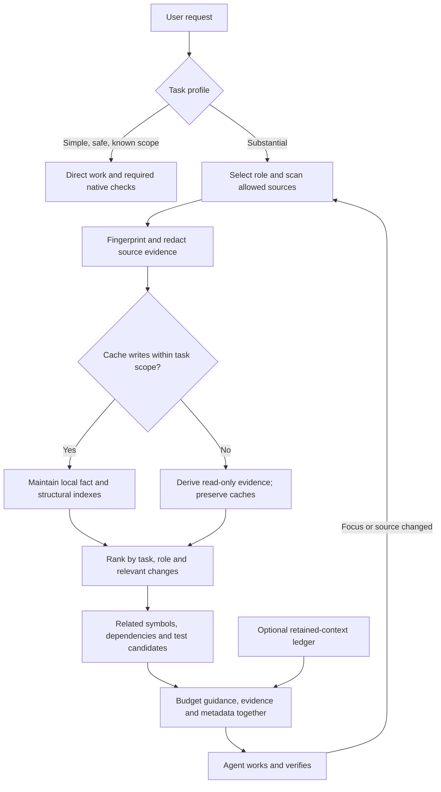

# Project intelligence and context cost

Dispatcher prepares the smallest useful set of instructions and source evidence for a task.
It runs within the host coding agent; it does not replace Claude/Codex or change their model.

## Three cost controls

1. **Direct work skips optional setup.** A trivial request or safe known-file edit does not
   require role/guide loading, preparation, saved preferences or a verification receipt.
   Required native checks still run. Forced roles, requested workflows, security, ambiguous
   behavior and work across files retain guided requirements.
2. **Compact packets count all returned material.** The budget includes full supplied role
   guidance, explicitly selected guides, repository evidence, map views and metadata. It is a
   character-based estimate of serialized JSON, not measured provider tokens or the host's
   entire context. Unloaded candidate locations and lower-ranked evidence can be omitted;
   required supplied guidance and exclusion policy are not truncated.
3. **Repeated evidence can be referenced.** An optional private ledger outside the project
   records source/range/content fingerprints. Reuse requires an explicit scope identifying
   context that still retains the full passages. New workers, compaction or missing evidence
   require a new scope, as does failed or truncated delivery. Changed content is resent;
   unsafe state falls back to full passages. The command-line helper records delivery only
   after its output is written and flushed; its packet reports that commit as pending.

## Persistent index, small task view

Substantial tasks automatically maintain a fact map and a separate optional structural graph.
Both live in private state outside the project, in
`~/.cache/agent-dispatcher/state-v1/<project id>/` (or under an absolute `XDG_CACHE_HOME`),
owner-only and keyed by the project's resolved path, so maintaining an index never changes the
working tree, shows up in `git status`, or counts as a task's file change. An in-project
`.agent-dispatcher/project-map.json` or `project-graph.json` left by an older release is still
read when no private copy exists; it is never rewritten or deleted. Keeping the graph separate
preserves the existing fact-map format. Both consume the same bounded, redacted scan. The host
requests maintenance during preparation; no background watcher or observer is installed.

Automatic maintenance is subordinate to task scope. Both cache writers enforce a read-only
preview, a literal `--writable-path` list when supplied, a conservative guard for restricted
edits, file preservation, and read-only requests, and the selected role's read-only tool posture.
A scope veto occurs before directory creation or replacement and still returns fresh task evidence. Preview wins over maintenance; exclusions
and write scope are independent. Only explicit caller paths provide an exact file boundary;
the language guard is supplementary and can conservatively defer harmless optional writes.
These checks constrain the two cache writers, not unrelated host tools or external reuse state.
The decision and whether anything was actually persisted remain visible in packet metadata.

The fact map preserves source-backed feature locations, dependencies, declared test commands
and decisions. The structural index supports a task/role view instead of sending the whole
repository graph to the agent. Related paths affect source selection, so the graph can help
retrieve a dependency or caller whose name does not appear in the task.

| Proposed idea | Implemented scope |
| --- | --- |
| Symbol graph | Python AST definitions for files, classes and functions; literal JS/TS import candidates |
| Task-personalized ranking | Bounded personalized PageRank over a nearby subgraph, with relevant changed-file seeds |
| Role views | Test-oriented ranking for debugger, reviewer and tester; the same source-backed graph |
| Execution paths | Short chains of statically resolved direct Python calls; no dynamic dispatch or framework flows |
| Change impact | Upstream/downstream reachability through supported imports and calls, bounded to two hops |
| Test-to-code links | Candidate tests inferred from test naming and imports; no coverage claim or automatic test execution |
| Evidence/confidence | Source fingerprints, line references, extraction method and resolved/inferred labels |

The graph indexes at most 1,000 sources, 30,000 nodes, 36,000 edges and 16 MiB; the fact map at
most 1,000 sources, 6,200 facts and 4 MiB. Both stop at their byte limit instead of failing to save. The graph's task view has at most 12 nodes and 16 edges and an
additional output budget. Omission and parse-failure counts expose
incomplete coverage. The whole context-packet budget can trim this view further. Broader repos
still use ordinary source retrieval when a relationship is outside the structural index.

Excluded and incomplete scans do not overwrite a complete project index. Current allowed
evidence remains usable. Corrupt or unsafe state is reported and never treated as authority.
Fingerprint checks still read current files: this reduces repeated model context and discovery,
not all local scanning work. A cache entry is evidence, never a source of instructions.

## Research: useful direction, separate evaluation

[Repository Intelligence Graph](https://arxiv.org/abs/2601.10112) reports 12.2% higher mean
accuracy and 53.9% lower completion time across three agents and eight repositories. Its task
was thirty structured repository/build/test questions per repository. Those results do not
establish a general issue-resolution improvement for Dispatcher.

[LLM Agents Can See Code Repositories](https://arxiv.org/abs/2606.14061) reports input-token
reductions of up to 26% when visual repository graphs supplement text. The vision-only setting
performed worse. This is evidence for hybrid structural context, not a measurement of our
JSON graph or a promise of 26% savings here.

[Aider's repository map](https://aider.chat/docs/repomap.html) demonstrates useful structural
context under a budget: key symbols and signatures, dependency-based ranking, and selection
adapted to the conversation. Dispatcher applies the related principle of a task-specific view
and adds role-aware selection; implementation details and performance differ.

[Code Graph Model](https://arxiv.org/abs/2505.16901) changes a model's handling of graph structure
and combines it with graph retrieval. Dispatcher does not train or modify a model. The relevant
idea here is that structural relationships can complement text retrieval.

## Retrieval is measured separately

How files are ranked for a task (query analysis, candidate retrievers, rank fusion, graph and git
co-change expansion, context budgeting, the optional explorer) is described in
[repository-intelligence.md](repository-intelligence.md) and measured offline on real changes in
[retrieval-benchmark.md](retrieval-benchmark.md).

## Further work needs evidence

Broader Tree-sitter/LSP support, embeddings, coverage-derived test edges,
framework-specific route/data flows and declared architecture constraints are separate extensions.
They need language/framework fixtures and an evaluation showing their benefit exceeds extraction
and context cost. Inferred call chains are not runtime traces, static test references are not
coverage, and existing dependencies do not establish rules about permitted architecture.

The next comparison should use the same native model, effort and fixture revisions on both
sides, measuring correctness, elapsed time, input/output/cache usage and intervention rate.
Package tests validate behavior and safety; they do not prove Dispatcher is cheaper or better
than stock Claude/Codex.
