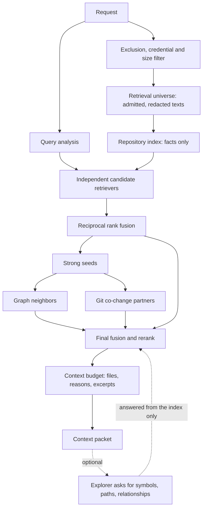

# Repository intelligence: finding the right files for a task

When a task is substantial, the context helper has to answer one question before the agent
starts: *which parts of this repository probably matter, and why?* This page explains how it
answers, how to inspect an answer, and how to measure whether a change made the answers better.

Everything here is local and deterministic. No model, embedding, network call or API key is
involved, and the same request on the same files always produces the same result.



Four responsibilities, four places:

| Layer | File | It decides |
| --- | --- | --- |
| Repository index | `repo_index.py` | nothing. It records facts: terms, symbols, imports, calls, tests, co-change |
| Retrieval engine | `retrieval.py` | which facts matter for this request, with provenance |
| Context engine | `context_budget.py` | what evidence fits the byte, token and file budget |
| Context helper | `context.py` | what may be read at all, and how the packet reaches the role |

The dispatcher still decides which role and skills handle the task. None of these layers do.

## What changed

Before, a request was split into words, each file earned a flat score (`+3` an exact identifier
or quoted phrase, `+2` a request word in its path, `+2` two or more request words in its
contents), and ties were broken alphabetically. On a large repository a long request makes
most files score the same, and the alphabet picks the context.

Now the request is analyzed, several retrievers each answer a different question, their rankings
are fused, strong results pull in structurally and historically related files, and a budget
step keeps the smallest useful evidence. The old scorer is still available as
`--retrieval legacy` and is the automatic fallback if the engine cannot load.

## Query analysis

A request is not a bag of equally important words.

```text
$ python3 -B retrieval.py explain-query "Fix sqlglot.executor so execute() handles unsupported table expressions."
IDENTIFIERS
  sqlglot.executor
  execute

CONCEPT TERMS
  unsupported
  table
  expressions

IGNORED/LOW-WEIGHT TERMS
  fix
  handles
```

Recognized, in order of strength: file paths (`src/foo/bar.py`), dotted names
(`requests.sessions.Session` becomes module `requests.sessions` plus symbol `Session`), call
syntax (`execute()`, `Client.connect()`), `CamelCase`, `snake_case`, `camelCase`, constants such
as `MAX_RETRIES`, and backticked code. Identifiers weigh three to four times a plain concept
word; their subtokens (`execute_table` also contributes `execute`, `table`) weigh half. Generic
words (fix, change, keep, update, handles ...) weigh nothing and are shown so you can see that.

Stack-trace frames are read as frames, not as prose: `File "/venv/.../sqlglot/planner.py", line 6,
in run` and `at run (/home/me/app/src/x.ts:12:5)` each yield a path, a line and a function name.
The path is matched by its longest suffix that exists in the index (a bare file name only when it
is unique), votes in the path retriever with the explicit-path weight (the innermost frame, last
in Python and first in JavaScript, counts double), anchors that file's excerpt on the frame's line,
and the function name becomes a symbol. Frames are never pinned: a traceback lists the call path,
not only the bug (`frames.enabled`, `full-frames` ablation).

Two ablation switches under `names` change how prose earns identifier weight; both are off by
default and used only through the benchmark's `--variant` until measured. `names.case_only:
"resolved"` weighs a word that looks like code only by its capitalization (`MySQL`, `GraphQL`; not
a call, backticked name, dotted name, `snake_case` word, all-caps word with a digit, frame function
or the file name of a path the request gives) by what it denotes in the index: no definition makes
it a concept, so its exact spelling (`GraphQL`, the form the index holds) and its lowercase form
become concept-weight terms, without subtokens or symbol weight; a definition plus its same-stem
non-test files (its *family*: `dialects/mysql.py`, `parsers/mysql.py`, ...) counted as n files
gives full weight for n = 1 and `concept + (identifier - concept) / sqrt(n)` otherwise, except that
the strictly most-mentioned of two or more such ambiguous names keeps full weight; a full-weight
name with a family also adds its lowercase stem (`mysql`) as a concept term. A name is never
dropped below concept weight, so a "keep X working" target stays in the query. `explain-query` has
no index and is unaffected; `explain` lists each decision under NAME CALIBRATION.
`names.slash_words: "resolved"` keeps an `A/B` token as a path only when it has a known file
suffix, ends an indexed path (extension optional) or is a run of its directories, tested on the
token as written less a trailing period and any leading `./` or `../` (`.github/workflows` keeps
its dot); `MySQL/Hive` or `ROLLUP/WITH` in prose are read as words and no longer make the plan
`exact`. The plan's caps report both switches.

## Candidate retrievers

Each retriever is a function `(query, index, config) -> ranked candidates` registered in
`retrieval.RETRIEVERS`; a future retriever is one more entry. Each candidate records the file,
its rank, a raw score and the reason.

| Retriever | Question it answers | Notes |
| --- | --- | --- |
| `path` | What file looks explicitly named? | explicit paths, dotted module resolution (`pkg.mod` -> `pkg/mod.py`, `pkg/mod/__init__.py`, then `pkg/mod/*`), exact file name, name token, directory, partial name. Weighted by how rare the token is among paths; never length-normalized |
| `rare_terms` | Where does this unusual concept occur? | presence x squared rarity, damped by the file's vocabulary size |
| `bm25` | Which file is lexically about this? | standard BM25 over identifier subtokens, with length normalization |
| `symbol_definitions` | Where is this thing defined? | exact, case-insensitive and `Parent.name` matches; a name defined in few files counts more |
| `symbol_references` | Who uses it? | only names the request treats as code, never prose words |
| `phrases` | Where does this quoted literal appear? | error messages, SQL, flags |

Rarity is continuous: `idf(t) = log(1 + (N - df(t) + 0.5) / (df(t) + 0.5))`. A word in every file
contributes almost nothing, a word in one file contributes most, and there is no "ignore above
10%" cliff. It stays positive so that a three-file project still retrieves something.

### Why several, and how they are combined

Path scores, BM25 scores and symbol scores live on unrelated scales, so adding them would need
hand-tuned exchange rates. Reciprocal rank fusion uses only ranks:

```text
RRF(file) = sum over retrievers of  weight / (k + rank of file in that retriever)      k = 20
```

A file that three retrievers each rank fifth beats a file that one noisy retriever ranks first.
`k = 20` was chosen on the benchmark's training split; the customary 60 mostly counts how many
lists contain a file and did worse on every metric. A file the request names outright (an
existing path, or a dotted name that resolves to one) is pinned first. Fused scores within 5% of
each other count as a tie and are settled by evidence (a definition, then a path match, then
identifier evidence, then structural evidence, then lower in-degree); the path itself is only
the last deterministic fallback.

## Symbols and the repository graph

The index is built from one record per file. For Python the record comes from `ast`: functions,
methods, classes, module constants, imports, called names and base classes, each with its line.
Other languages use declaration patterns (functions, classes, interfaces, types, top-level
constants) and relative JS/TS imports; they have no call or inheritance edges, and a file that
fails to parse is still indexed lexically. Nothing is guessed: an unknown relationship stays
unknown.

An admitted file over the 256 KiB read limit is read once (up to 4 MiB, within a 16 MiB budget per
scan), redacted, and parsed with the same extractor; its text is never retained. Its record keeps
definitions, imports, calls, base classes and its terms, so it ranks by symbol, edge and word like
any file (`index.coverage`: `complete`, or `partial_lexical` with the covered line span when the
file is longer than the cap). Its terms add no `references` edges (`oversized.references: false`):
a file that size mentions nearly every name in the repository, and as a graph seed it pulled
unrelated files in; `full-oversized-references` is the ablation that restores them. When selected, only excerpt spans are served, re-read and checked
against the indexed bytes; a file that changed since is withheld as stale. `oversized.lexical:
false` (strategy `full-oversized-structural`) is the ablation that keeps only the definitions, never
excerpted, the packet marking the file "over the file read limit"; `structural_records: false`
(`full-structure`) drops the record and leaves only the name.

From the records the index resolves edges: `imports`, `calls`, `references` (a distinctive name
defined in at most three files), `inherits`, and `tested_by` (test naming such as
`test_foo.py`, `foo.test.ts`, `foo_test.go`, plus what the test imports). You can ask it
directly: `index.definitions["execute"]`, `index.referencing("execute")`,
`index.symbols_in("sqlglot/executor.py")`, `index.neighbors(path)`.

### Controlled expansion

The top five fused files become seeds. Each seed contributes its neighbors, scored

```text
seed strength (1 / seed rank) x hop decay x edge prior / log(2 + in-degree of the neighbor)
```

with edge priors calls 1.0, references and inherits 0.8, tests 0.7, imports 0.5, and at most
eight neighbors per seed, one hop (configurable) and twenty graph candidates. The in-degree term
keeps a utility module that everything imports from flooding the result. Sharing a directory is
weak evidence: it can reinforce a file that something else already found, never introduce one.
The graph is a retrieval signal; it is not dumped into the prompt.

## Git co-change

`git log` (bounded to 2,000 commits, 4 MiB and 10 seconds) yields which files changed together.
Commits touching more than 30 files are ignored as bulk edits. The relationship is the Jaccard
index

```text
commits touching both / commits touching either        (at least 2 shared commits)
```

which normalizes both sides, so a file that changes in every commit is not "related" to
everything. A seed's partners become one more, half-weight vote in the final fusion, with the
reason "frequently co-changed with X". History never finds a file on its own, recency decay
(`git.half_life_days`) is off by default, and a missing, shallow or non-git history simply
yields no signal.

Every partner is counted over one eligible event population (the commits that passed the size
cap), and `explain` spells the denominators out next to the score: "changed in 4 of the 5 eligible
events containing sqlglot/planner.py; 5 eligible events in the window". A percentage never
travels without its support count and window; when the counts are unavailable (a deep index
whose stored history predates this release) the evidence says so instead of showing zero. The
packet line stays the compact `jaccard 0.8, 4 commits`. Two alternative statistics exist as
ablation switches over the same population, support floor and partner cap: `git.statistic:
"conditional"` (P(partner | seed), `git.shrinkage` events added to the denominator) and `"lift"`
(gated by `git.min_lift`). They were measured on the development split and left off; see
[the benchmark](retrieval-benchmark.md#co-change-statistics-measured-and-declined-2026-09-23).

## Context budget

Retrieval ranks; the budget decides what is worth the agent's attention. The packet obeys
limits on files, bytes and estimated tokens (the size tiers still set the defaults; `--max-files`
and `--max-bytes` lower them). For each kept file the packet says why it was selected, which
matched symbols it defines, how it relates to the other selected files, and bounded excerpts:
the definition of a matched symbol (capped at 40 lines), then lines that use a named
identifier, then lines containing the rarest matched terms. A 3,000-line file with one relevant
function contributes that function, not the file. Every file gets its best excerpt, sized to an equal share of what is left, before any
file gets a second one, so a tight budget shrinks every window instead of starving the
lower-ranked files. Tests are held to a third of the files and byte-identical copies (vendored
or generated) wait behind distinct files; when nothing more varied wants the room, the held
files take it back. A file over the 256 KiB read limit can still be ranked by its name, imports
and history; it is listed with a note and never excerpted.

```text
REPOSITORY CONTEXT
==================
Task signals:
- modules: sqlglot.executor
- symbols: execute

1. sqlglot/executor/__init__.py
Why selected:
- dotted name resolves to this module: sqlglot.executor (path #1)
- defines function: execute:4 (symbol_definitions #1)
Relevant symbols:
- execute
Relationships:
- tested by tests/test_executor.py
- calls sqlglot/executor/python.py (PythonExecutor)
Relevant excerpt (lines 3-6):
  4 | def execute(sql, tables=None):
```

## Optional explorer

Retrieval does not have to be right the first time. An explorer looks at the packet and asks
for what is missing, in a fixed vocabulary:

```json
{"status": "expand", "confidence": 0.58,
 "reason": "The function is defined, but its caller is not in context.",
 "requests": [{"type": "callers", "value": "execute"}, {"type": "symbol", "value": "QueryPlanner"}]}
```

Request types are `symbol`, `path`, `callers`, `references` and `neighbors`; the older spelling
(`new_symbols`, `new_paths`, `follow_relationships`, `stop`) is accepted too. The retrieval layer
answers from the index, fuses the answers as one more vote and rebuilds the packet. The explorer
never reads a file or chooses what is returned. It is bounded (2 iterations, 10 requests and 5
new files per iteration by default), stops on `"status": "sufficient"`, `"stop": true` or a
confidence of 0.8, and is **off by default**. `confidence` is a stopping signal, not a
probability.

Two explorers exist. `--retrieval full+explorer` uses a built-in, model-free one (named symbols
without a definition, definitions without a caller, implementations without a test). A host role
such as the Explorer can act as one itself, without any model call made by this package:

```bash
python3 -B retrieval.py expand "the task" --project . --iteration 1 \
  --findings '{"requests": [{"type": "callers", "value": "execute"}]}'
```

## Exclusions are enforced before retrieval

```text
repository -> exclusion / credential / size filter -> retrieval universe -> everything else
```

`context._scan_sources` is the only place files are opened. It applies explicit and
task-derived exclusions, the credential rules (`.env*`, `credentials*`, `secrets*`, key files),
generated and dependency directories, symlink and size limits, then redacts what it admits. The
index is built from those texts and nothing else. Consequently a symbol defined only in an
excluded file does not exist, an edge to it is never created, `git log` paths outside the
universe are dropped before anything is counted (credential names are dropped before the history
is even cached), an explorer request for it returns nothing, and explain output cannot mention
it. `tests/test_retrieval_security.py` tries every one of those channels.

## Caches

Nothing new is written into the project. Per-file index records and the policy-filtered git
history live in the existing private, HMAC-signed parser cache under `~/.cache/agent-dispatcher`,
keyed by content fingerprint and by `HEAD`. They follow the same write gate as before: only an
unrestricted `--map-maintain` call may persist. A changed file recomputes one record; edges are
re-resolved in memory. The project map and graph are private too
(`~/.cache/agent-dispatcher/state-v1/<project id>/`); in-project copies from older releases are
only read.

An explicitly built deep index ([repository-index.md](repository-index.md)) can replace the shard
cache as the source of records, extend the ranking to files the per-request scan could not read,
and attach two further labeled retrievers (task experience and Explorer inferences); without one,
this page describes the whole behavior.

## Inspecting a decision

```bash
python3 -B retrieval.py explain-query "Fix execute() for unsupported tables"
python3 -B retrieval.py explain "Fix sqlglot.executor so execute handles unsupported tables" --project . --verbose
python3 -B context.py --project . --task "..." --explain --json      # the same trace inside a packet
```

`explain` lists, for every top file, each retriever that found it with its rank and reason,
graph and history evidence with the seed that led there, and whether the file survived
budgeting (and if not, why: file limit, byte budget or a diversity cap). `--verbose` adds the
pipeline: tokens, concepts, candidates per retriever, merged size, seeds, graph and git
additions, final count, context size and latency, plus pairwise candidate overlap.

Two lines precede the ranking. `PLAN` is the deterministic retrieval plan for the request: a
profile (`exact`, `history`, `impact`, `tests`, `behavior`, `vague`) with the reason codes that
produced it (`explicit_path`, `traceback_frames`, `qualified_name`, `identifier`,
`quoted_literal`, `concept_terms_only`, `asks_for_tests`, `history_wording`, `impact_wording`),
the families that run (the deterministic retrievers, any supplied lists such as the worktree or
memory layers, graph and git expansion with the co-change statistic and support floor), whether
the reranker is configured and under which policy, and whether the explorer is on. The plan's
policy is `observe`: it explains and stratifies, it does not switch a deterministic family off
(each costs milliseconds and keeps the baseline coverage path) and the optional stages keep the
gates they already had. `STATUS` is the result's standing, kept apart from its ranking: `ok`,
`abstained_no_sufficient_local_evidence` (a known universe, nothing ranked), or `unavailable`
(nothing indexed), with the evidence label of the top window (`anchored`: a named path, a
resolved dotted name, a frame, an exact file name, a symbol or a quoted literal backs a top file;
`lexical`: only content similarity, graph or history does) and conditions a reader must know:
`partial_coverage` with the number of admitted files that could not be read, `budget_exhausted`
with the files dropped for bytes, `provider_failed` with the reranker's error. A missing
representation or history never turns into "no relevant source exists".

`--verbose` also prints what each stage did to the top window. `EXPANSION EFFECT` names the files
graph and git expansion introduced into the top ten (with the source that brought each), the
baseline files they pushed out, and how many moved; `RERANK EFFECT` does the same for an applied
model opinion. A stage that adds neighbors is not thereby improving the ranking, and the
benchmark reports the same numbers per task
(`--json` rows carry `status` and `displacement`; the report adds a stratum by evidence label).

## Configuration

Every number lives in `retrieval.DEFAULTS` (weights, `rrf_k`, candidate limits, seed count, hop
decay, edge priors, git bounds, kind priors including the implementation-versus-test weight,
context limits, explorer limits). Named strategies are overlays on it:

| `--retrieval` | Meaning |
| --- | --- |
| `auto` (default) | `full`, falling back to `legacy` with a diagnostic if the engine cannot load |
| `legacy` | the previous flat scorer, unchanged |
| `hybrid`, `hybrid+graph`, `full` | retrievers + RRF; plus graph; plus git, kind priors and the context optimizer |
| `full+explorer` | `full` with the built-in explorer |
| `full-<component>`, `+<component>` | ablations used by the benchmark |
| `--set fusion_groups=…`, `--set graph.multi_edge=sum` | grouped voting and multi-edge neighbor scoring, measured and left off ([benchmark](retrieval-benchmark.md#retrieval-follow-ups-measured-and-declined-2026-09-22)) |
| `full+role`, `role-only`, `bm25+role`, `full+rerank`, `full+role+rerank` | [LLM-assisted retrieval](llm-assisted-retrieval.md) experiments: inert without stored role representations and a user-enabled reranker |

An optional, opt-in LLM layer (model-written role summaries as one more retriever, and a bounded
candidate reranker) is described in [llm-assisted-retrieval.md](llm-assisted-retrieval.md). With it
off, which is the default, everything on this page is unchanged and no model is ever called.
Likewise optional: [repository memory](repository-memory.md), whose gated candidates from
eligible Git history, module summaries and recorded experience enter the same fusion as the
`memory_git`, `memory_semantic` and `experience` voters (history and semantic memory ship in
shadow mode; experience is on but empty until a record is handed in).

## Measuring it

`evals/retrieval/` holds an offline file-localization benchmark built from real changes in
sqlglot, pip, networkx and zod (TypeScript): see [its README](../evals/retrieval/README.md).
Measured results, ablations and known weaknesses are in
[retrieval-benchmark.md](retrieval-benchmark.md).
